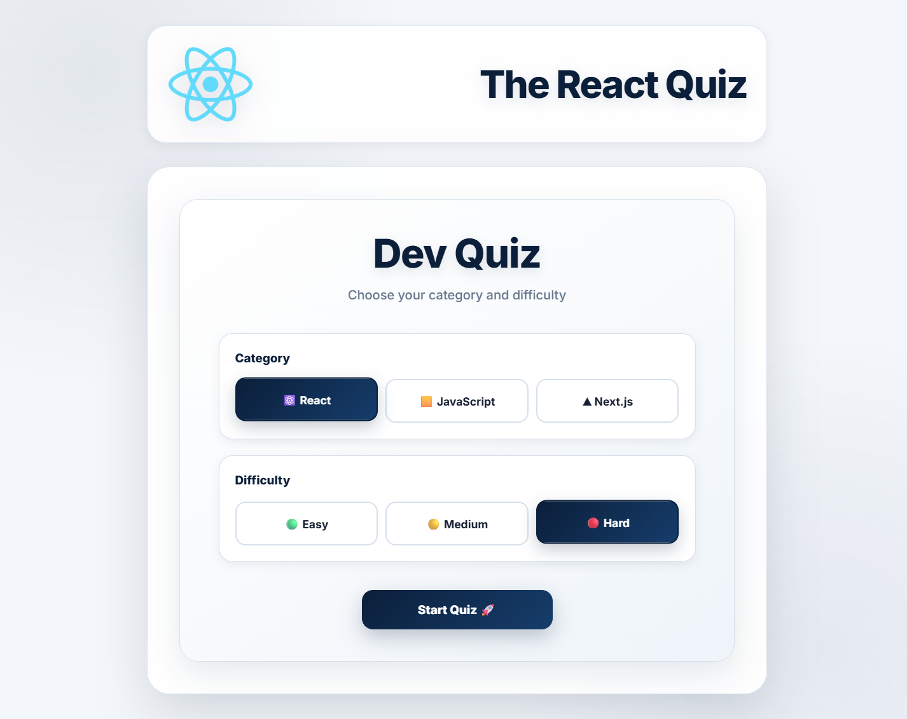
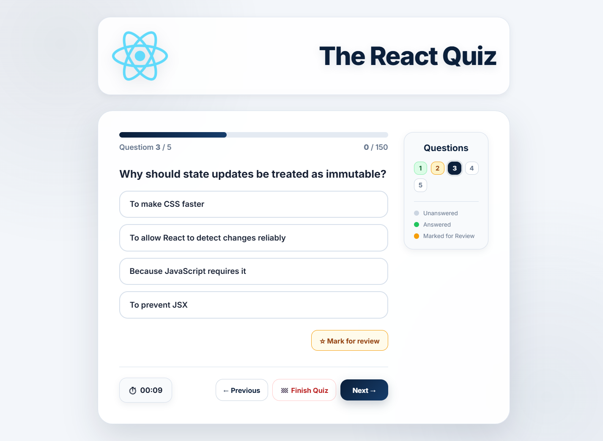
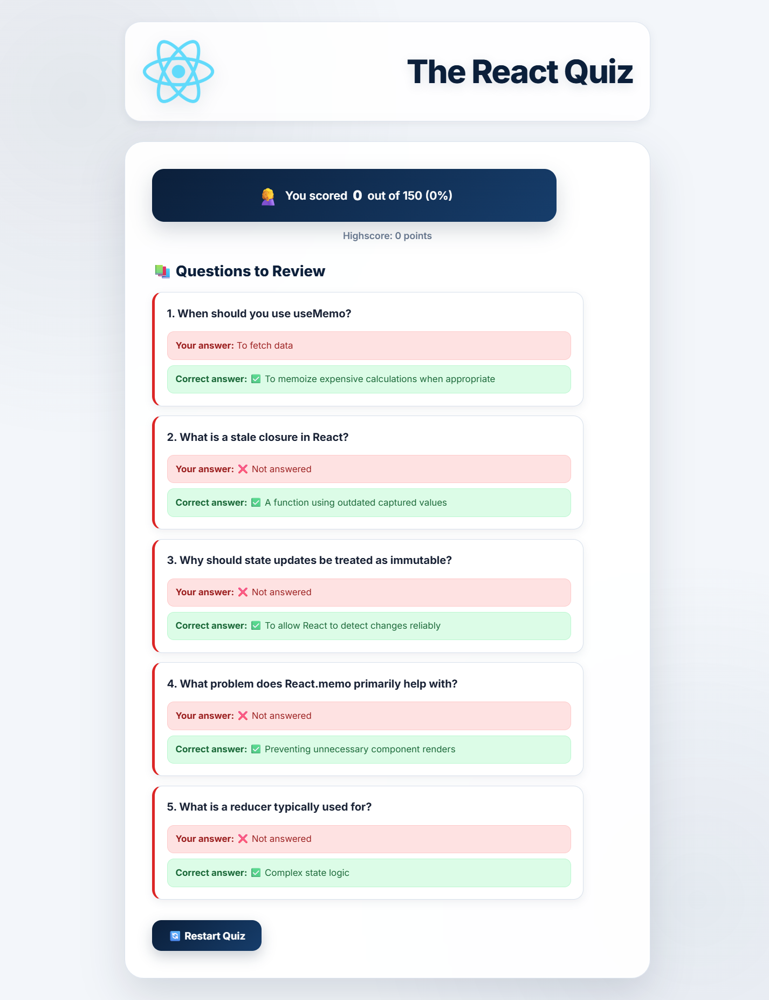

# 🧠 Dev Quiz

A modern and interactive quiz application built with **React**.

Users can test their knowledge of **React, JavaScript, and Next.js** by selecting a category and difficulty level.

## 🎥 Live Demo

> **🔗 [View Live Demo](#)** _(Add your deployed link here)_

## 📸 Screenshots

### Start Screen



### Quiz Screen



### Result Screen



## ✨ Features

- 🎯 Choose quiz category: React, JavaScript, Next.js
- 📊 Choose difficulty: Easy, Medium, Hard
- ⭐ Score system based on question difficulty
- ⏱️ Countdown timer
- 🧭 Question navigation
- ✅ Track answered and unanswered questions
- ⭐ Mark questions for review
- 📚 Review incorrect and unanswered questions after finishing
- 🏆 High score tracking
- 🔄 Restart quiz with a new category and difficulty

## 🛠️ Built With

- React
- JavaScript
- CSS
- React Hooks
- useReducer
- JSON Server
- Fetch API

## ⚙️ Installation

```bash
npm install
```

Run the React app:

```bash
npm start
```

Run JSON Server:

```bash
npx json-server --watch data/questions.json --port 8000
```

## 👨‍💻 Author

**Mobina Zare**

📧 Email: [itsmobinazare@gmail.com]
💼 LinkedIn: https://www.linkedin.com/in/mobina-zare-9345122b5

Built with ❤️ using React.
